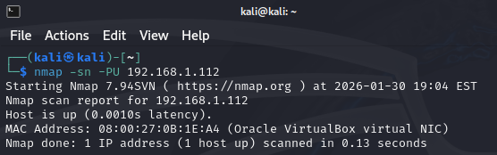
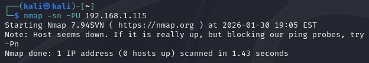
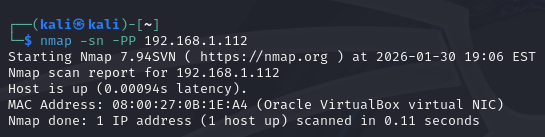
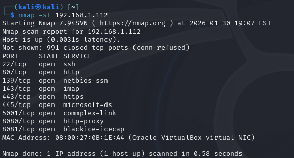
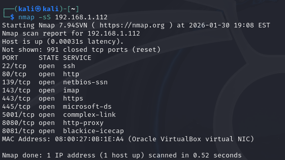
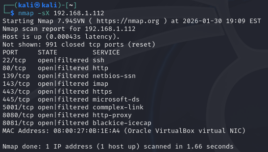
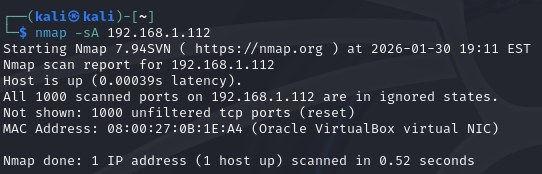
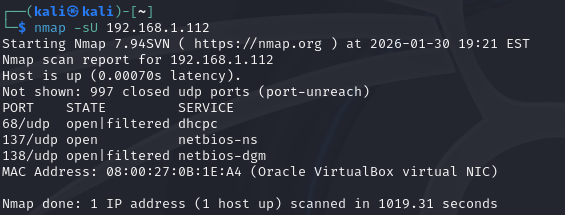

# Network Discovery and Port Scanning

This exercise demonstrates network reconnaissance and scanning techniques performed against an OWASP Broken Web Application hosted on an internal network. The attacker system (Kali Linux) and the target application reside within the same subnet, allowing direct probing without external routing restrictions.

The goal is to compare how different Nmap scan types behave and what information they reveal about the target system.

**Target Host:** OWASP Broken Web Application  
**Target IP:** 192.168.1.112  
**Attacker System:** Kali Linux  
**Tool Used:** Nmap

---

## Tool Used
Nmap was used to perform network discovery and port scanning against an internal host. The tool enabled identification of active systems, exposed services, and firewall behavior using multiple probing techniques.

For details on the tool’s functionality and scanning techniques, see:  
[Tool documentation – Nmap](../tools/nmap.md)

## Host Discovery via UDP Probing

A UDP-based discovery scan was performed to determine whether the target system was active.

```bash
nmap -sn -PU 192.168.1.112
```
The scan confirmed that the host was reachable and responding to network probes. Because the system resides within the same subnet, Nmap was also able to resolve the MAC address of the host.

The image below shows the results of the discovery scan for the target host:


To establish a comparison, the same command was executed against an unused IP address within the same network range. The unused IP did not respond, demonstrating how Nmap distinguishes between live and inactive hosts.

The image below shows the results of the discovery scan for the unused IP within the same network:


---
## ICMP Timestamp-Based Discovery
An ICMP timestamp probe was used to further validate host availability and retrieve time-related information from the target.
```bash
nmap -sn -PP 192.168.1.112
```
This scan confirmed that the host was active and provided timestamp-related responses, which can sometimes be used to infer system configuration, uptime characteristics, or clock synchronization behavior.

The image below shows the results of this scan:



---
## TCP Port Scanning Techniques
Several TCP scanning techniques were used to analyse port exposure and filtering rules on the target host.

### TCP Full Connection Scan
```bash
nmap -sT 192.168.1.112
```
This scan completed the full TCP three-way handshake for each port. While reliable, this method is highly detectable due to fully established connections.


### TCP SYN (Stealth) Scan
```bash
nmap -sS 192.168.1.112
```
The SYN scan identified open ports without completing the handshake, making it less intrusive and more suitable for stealthy reconnaissance.


### TCP Xmas Scan
```bash
nmap -sX 192.168.1.112
```
The Xmas scan returned port states such as open|filtered, showing how non-standard TCP flag combinations can bypass or confuse filtering mechanisms.



### TCP ACK Flag Scan
```bash
nmap -sA 192.168.1.112
```
The ACK scan did not reveal open ports but indicated that the scanned ports were unfiltered. This technique is useful for identifying firewall rules rather than running services.



### UDP Port Enumeration
A UDP scan was conducted to identify UDP services exposed by the target system.
```bash
nmap -sU 192.168.1.112
```
Unlike TCP scans, UDP scans rely on indirect responses and timeouts. The results revealed UDP ports that were open or responding, highlighting services that may not be immediately visible through TCP-only assessments.



---
## Analysis and Observations
Each scan technique provided distinct insights:
- Discovery scans confirmed host availability
- SYN and Xmas scans revealed ports more discreetly
- ACK scanning exposed filtering behavior
- UDP scanning identified additional service exposure

Using multiple reconnaissance methods together produces a more complete picture of a system’s attack surface.

---
## Key Takeaways
- Different scan types serve different reconnaissance goals
- Firewall behavior significantly influences scan results
- UDP services should not be overlooked
- Effective reconnaissance relies on combining techniques rather than relying on a single scan