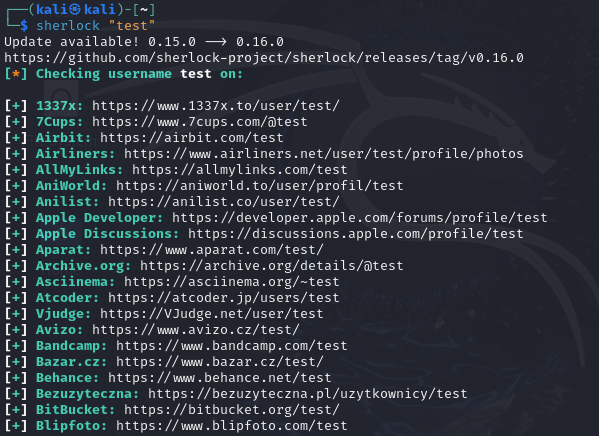

# OSINT-Based Username Enumeration

## Objective
The objective of this exercise was to perform reconnaissance using Open Source Intelligence (OSINT) techniques by identifying the online presence of a target username across multiple platforms.

This activity demonstrates how publicly available information can be aggregated to build a digital footprint that may support further reconnaissance or social engineering activities.

---

## Tool Used
Sherlock was used to perform automated username enumeration across a large number of social networking and online platforms.

For details on the tool’s functionality and limitations, see:  
[Tool documentation – Sherlock](../tools/sherlock.md)

---

## Methodology
A test username was supplied to the Sherlock tool. Sherlock generated platform-specific URLs associated with that username and issued HTTP requests to determine whether the username existed on each supported service.

The presence or absence of the username was inferred based on HTTP response codes and page content returned by the platforms.

---

## Results and Observations

The image below shows the output of Sherlock when executed against the username **`test`**, indicating platforms where the username was detected and platforms where it was not found.

This demonstrates how even a simple or common username may have a wide and traceable online presence.

---

## Security Implications
This exercise highlights several security considerations:

- Username reuse increases exposure across multiple platforms
- Public information can be leveraged for targeted attacks
- OSINT reduces the effort required to profile individuals or organisations

---

## Defensive Considerations
- Avoid reusing usernames across services
- Limit publicly available profile information
- Educate users on how OSINT is leveraged during reconnaissance