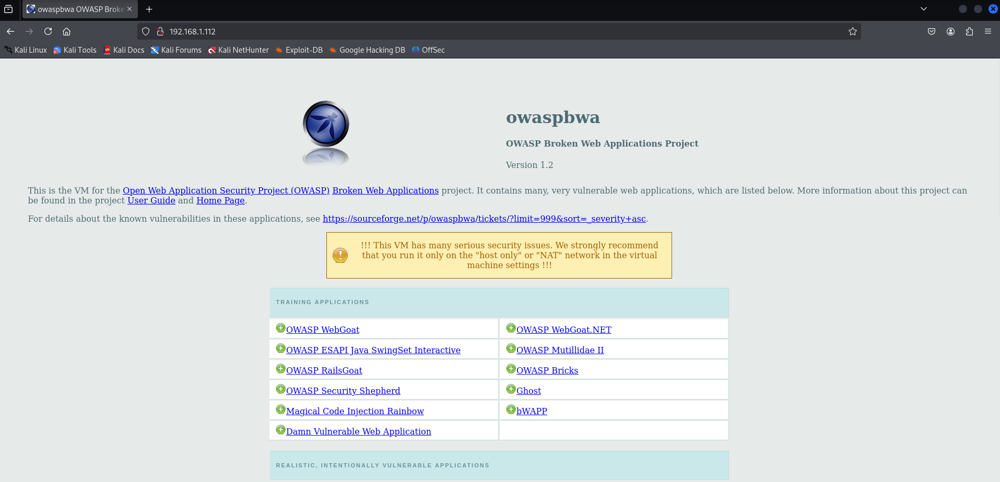
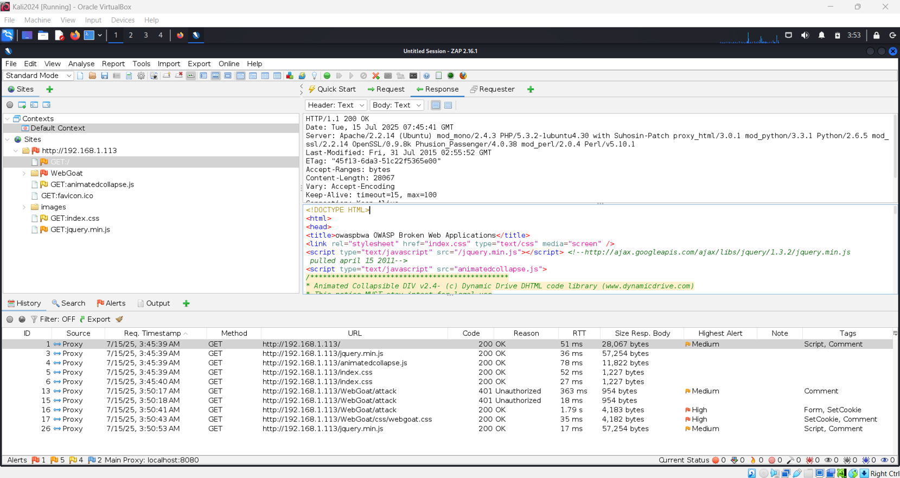

# Banner Grabbing Using OWASP ZAP

## Objective
The objective of this exercise was to perform banner grabbing against a web application in order to identify server information exposed through HTTP response headers.

This activity demonstrates how attackers can collect system metadata during the reconnaissance phase without exploiting application logic.

---

## Lab Context

- **Attacker machine:** Kali Linux
- **Target application:** OWASP Broken Web Application
- **Network:** Same internal subnet

The attacker and target application were hosted within the same isolated network to allow safe interception and analysis of traffic.

---

## Tool Used
OWASP ZAP was used as an intercepting proxy to capture and inspect HTTP requests and responses exchanged between the browser and the OWASP Broken Web Application.

For detailed information about the tool, see:  
[Tool documentation – OWASP ZAP](../tools/zaproxy.md)

---

## Methodology

1. The browser on the Kali Linux machine was configured to route traffic through OWASP ZAP.
2. The OWASP Broken Web Application was accessed through the browser.
3. ZAP intercepted the HTTP responses from the server.
4. The response headers were examined via the ZAP user interface to identify exposed server information.

---

## Results and Observations

The following image shows successful access to the OWASP Broken Web Application through the proxy:

The intercepted response headers revealed the following information:

- **Server type and version:** Apache 2.2.14 (Ubuntu)
- **Last modified date:** 31 July 2015

The image below shows the response headers captured by OWASP ZAP:

---

## Security Implications

Exposed server metadata provides valuable information to attackers:

- Server version details can be correlated with known vulnerabilities
- Older versions may indicate missing patches or outdated configurations
- Last modified dates can suggest whether an application is actively maintained

Attackers may use this information to research exploits or reproduce the application environment for offline testing.

---

## Defensive Considerations

- Disable or minimise server version disclosure
- Regularly patch and update web servers
- Implement security headers and hardening configurations
- Monitor for reconnaissance activity at the network and application layers